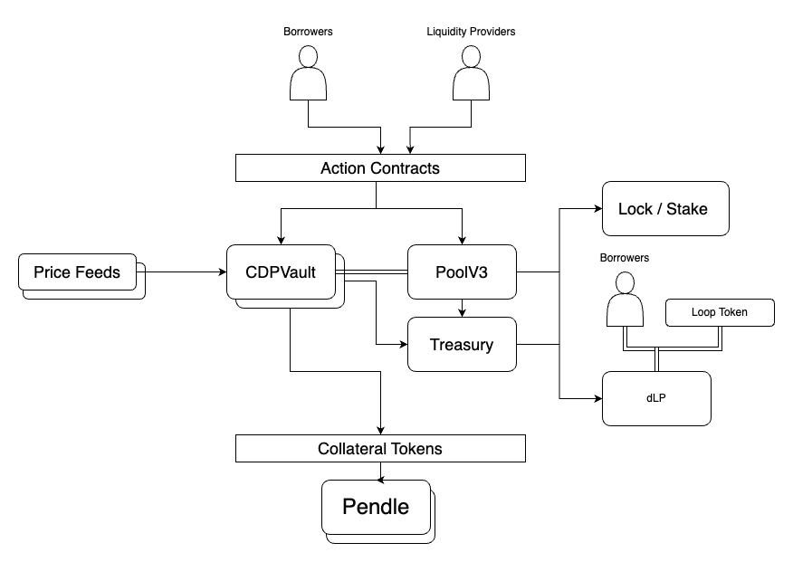

# Loop DeFi Smart Contract

**Loop** is a decentralized finance (DeFi) platform designed to optimize yield distribution among participants through innovative lending, borrowing, and staking mechanisms.

This is a flow diagram of the Loop DeFi system:

## Overview

The platform's core concept revolves around leveraging ETH-based yields, utilizing receipt tokens, and staking mechanisms to align incentives between various actors:

- **Lenders:** Receive `lpETH` tokens in exchange for ETH deposits, which can be further staked to earn passive yield in ETH.
- **Borrowers (Loopers):** Can borrow ETH against yielding LRT derivatives to engage in carry trades and optimize returns on ETH-based yields.
- **dLP Lockers:** Lock the governance token `LOOP` into a Dynamic Liquidity Position (`dLP`) to earn protocol revenue.
- **Interest Rebates:** Loopers can offset borrow costs by locking 5% of their Total Looped Position Size in the `dLP`, effectively receiving rebates on interest paid.

## Core Smart Contracts

### 1. CDPVault

The `CDPVault` contract manages the core logic of the borrowing and lending functionalities. It allows users to deposit collateral, borrow against it, and handle repayments.

**Public Interface:**
- `deposit(address to, uint256 amount)`: Deposits collateral tokens into the vault.
- `withdraw(address to, uint256 amount)`: Withdraws collateral from the vault.
- `borrow(address borrower, address position, uint256 amount)`: Borrows ETH against collateral.
- `repay(address borrower, address position, uint256 amount)`: Repays borrowed ETH.

**Liquidity Management:**
The `CDPVault` utilizes `PoolV3` for liquidity management. The liquidity pool facilitates lending and borrowing activities, managing deposits, withdrawals, and interest accruals.

#### Interaction with PoolV3:
- **Borrowing:** The `CDPVault` borrows from `PoolV3` against the deposited collateral and the available liquidity.
- **Repayments:** Repayments to the vault are forwarded to `PoolV3`, updating the total debt and interest accordingly.

### 2. PoolV3

`PoolV3` is a contract that provides a liquidity pool for the `CDPVault`. It handles the aggregation of funds, debt management, and distribution of interest among liquidity providers.

**Key Functions:**
- `deposit(uint256 assets, address receiver)`: Allows underlying asset deposits into the pool.
- `withdraw(uint256 assets, address receiver, address owner)`: Withdraws the specified amount from the pool.
- `lendCreditAccount(uint256 borrowedAmount, address creditAccount)`: Facilitates lending to credit accounts.
- `repayCreditAccount(uint256 repaidAmount, uint256 profit, uint256 loss)`: Handles repayments and adjusts the pool's state accordingly.

### 3. Treasury

The `Treasury` contract manages protocol revenues, distributing fees generated by the `CDPVault` and `PoolV3` among stakeholders, including dLP lockers and ETH stakers.

### 4. StakingLPEth

The `StakingLPEth` contract allows `lpETH` holders to stake their tokens and earn passive yield in ETH.

### 5. FlashLender

The `FlashLender` contract enables leveraging positions and executing flash loans.

## Auxiliary Contracts

The Loop protocol provides a set of auxiliary contracts to enhance user experience and flexibility. These contracts work in conjunction with the core contracts, enabling complex interactions and optimizations.

### Action Contracts

Action contracts facilitate the bundling of multiple transactions into a single contract interaction, allowing users to efficiently manage their positions and leverage within the protocol.

- **PoolAction:** Facilitates interactions with the pool, such as deposits and withdrawals.
- **PositionAction:** Bundles transactions related to the `CDPVault`, allowing users to leverage positions by performing multiple actions in a single transaction.
- **Swap and Transfer Actions:** Provide wrappers over swapping and transferring functionalities, enabling users to perform these actions seamlessly within the protocol.

### Oracle Contracts

The protocol uses robust and trustworthy price feeds powered by Chainlink. These Oracle contracts ensure reliable and accurate asset pricing, which is critical for maintaining the integrity of the system.

- **Price Feeds:** The Oracle contracts fetch asset prices using Chainlink, providing secure and decentralized data feeds for the protocol.
